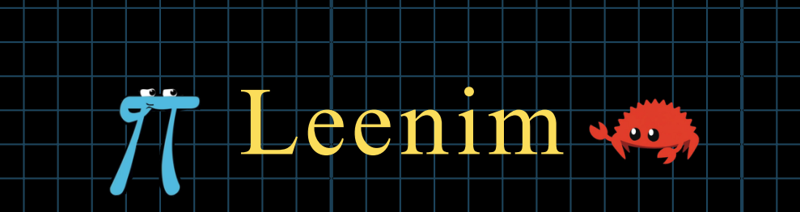
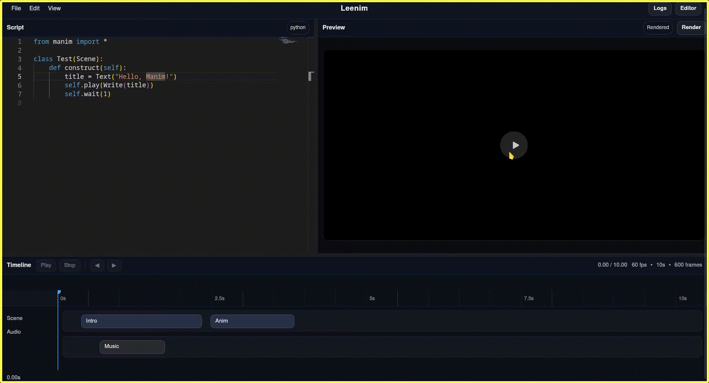

 
<i>Easy to use GUI editor for the Manim Engine</i>

Leenim is a cross platform easy to use (or *leen*) GUI application that takes a similar approach to traditional video editors for creating mathematical animations using [Manim](https://github.com/ManimCommunity/manim)

